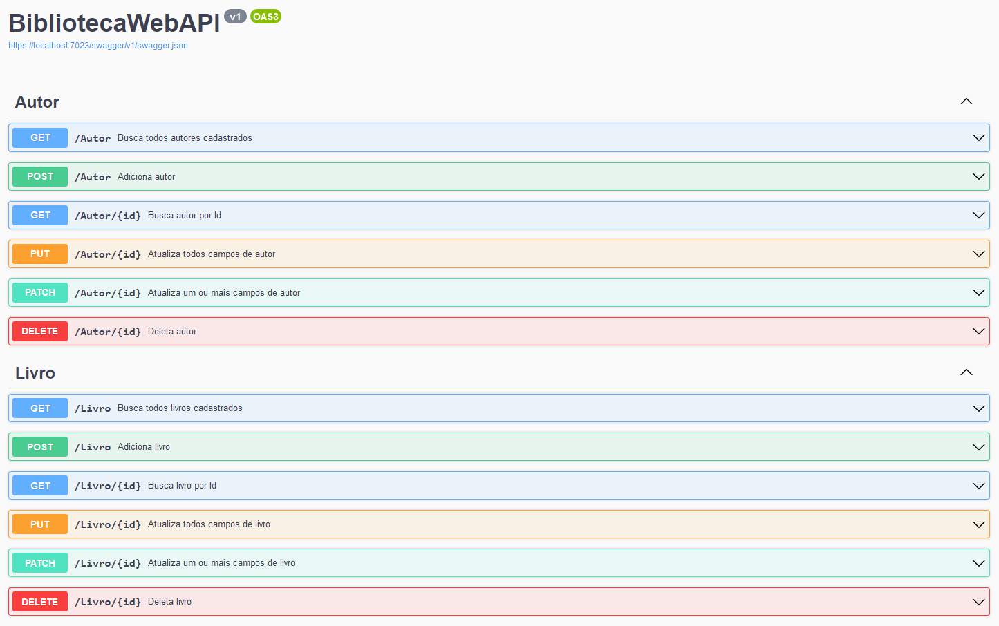

### Objetivos <h3>
Esse projeto tem o objetivo principal de servir como portfólio para demonstrar o uso da linguagem C# com framework ASP.NET Core, seus pacotes e ferramentas.

Também tem o intuito de estudo, desenvolvimento profissional e registo de minha evolução utilizando essas tecnologias. 

### Descrição da API <h3>
CRUD de Autores e Livros 

### Tecnologias utilizadas <h3>
* **C#** para desenvolvimento do back-end;
* **ASP.NET Core** como framework;
* **Entity Framework** para persistência de dados;
* **Swagger** e **Swashbuckle** para documentação dos endpoints da API;
* **AutoMapper** e **NewtonsoftJson** para mapeamento de objetos;
* **SQL Server** como banco de dados relacional.
### Ferramentas para desenvolvimento e testes <h3>
* Microsoft Visual Studio 2022 Community;
* SQL Server ObjectExplorer como gerenciador de bando de dados;
* Postman para teste da API.
 
<h1 align="center">
  
</h1>
